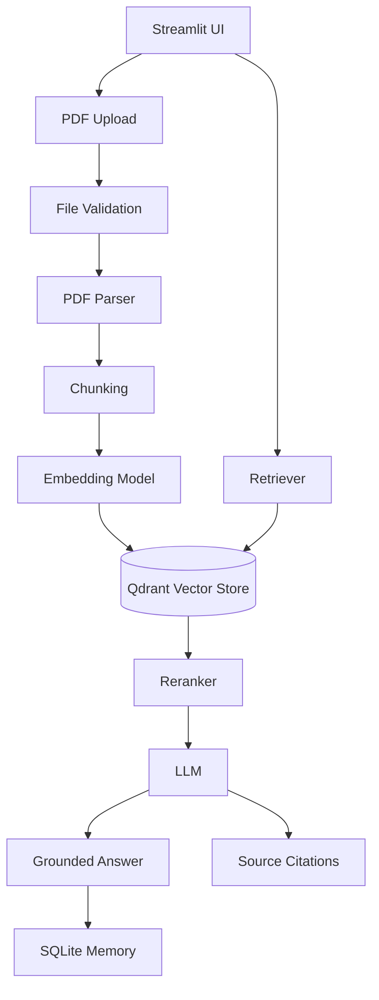

# Architecture Overview

## System Diagram

## Component Responsibilities

| Component | Responsibility |
|-----------|---------------|
| `src/config/settings.py` | Typed configuration via pydantic-settings |
| `src/ingestion/` | PDF validation, parsing, chunking pipeline |
| `src/embeddings/` | Embedding model factory (OpenAI / local) |
| `src/vectorstore/` | Qdrant integration with metadata filtering |
| `src/retrieval/` | Query processing, retrieval, reranking |
| `src/llm/` | LLM factory, prompt engineering, answer generation |
| `src/chat/` | Conversation memory (SQLite), chat service |
| `src/evaluation/` | RAG evaluation metrics and runners |
| `src/utils/` | Logging, hashing, exceptions |

## RAG Pipeline

1. **Ingestion**: PDF → validate → parse → chunk → embed → store in Qdrant
2. **Retrieval**: User query → normalize → embed → semantic search → optional rerank
3. **Generation**: Retrieved context + system prompt → LLM → grounded answer
4. **Memory**: Conversations persisted to SQLite for cross-session recall

## Security Layers

- File validation (extension, magic bytes, size)
- Duplicate detection (SHA-256 hashing)
- Prompt injection resistance (system prompt + untrusted content policy)
- Secret protection (no API keys in logs/UI/repr)
